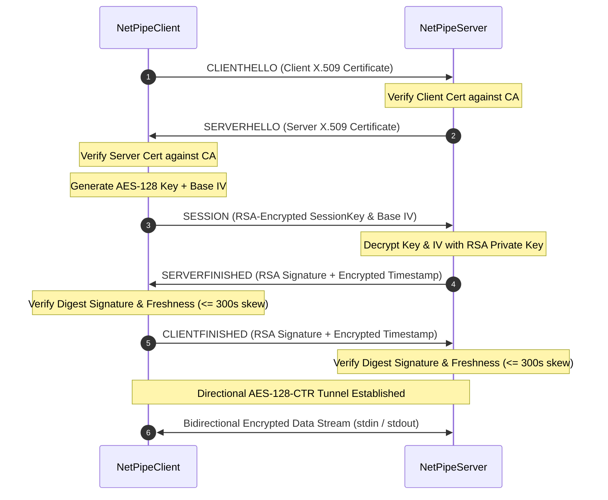

# Secure NetPipe

[](https://github.com/ermia1230/netpipe/actions/workflows/ci.yml)

Secure NetPipe is a custom encrypted transport proxy implemented in Java 17 over TCP sockets. It establishes a mutually authenticated, encrypted tunnel between a client and a server, forwarding standard input and output stream traffic.

> ⚠️ **Educational Implementation**: This repository was created to study custom binary protocol design, state machine enforcement, Java Cryptography Architecture (JCA/JCE), and automated verification. It is **not** a replacement for standardized protocols such as TLS in production systems.

---

## Architecture & Protocol Design

For detailed documentation, see the architectural specifications:
- [Protocol Specification (`docs/protocol.md`)](docs/protocol.md)
- [Architecture & Design Rationale (`docs/architecture.md`)](docs/architecture.md)

### Handshake Sequence



---

## Technical Features & Security Engineering

- **TCP Framing & Memory Exhaustion Safeguards**: Handshake messages are framed with a 4-byte big-endian length prefix. Payload size is capped at 64 KB (`MAX_MESSAGE_SIZE = 65536`) to protect against memory exhaustion from malformed headers. Partial TCP reads are handled using `DataInputStream.readFully()`.
- **Protocol State Machine**: Both endpoints enforce state transitions via a thread-safe `ProtocolStateMachine`. Out-of-order messages (e.g. receiving `SESSION` prior to `SERVERHELLO`) trigger `ProtocolStateException` and terminate the connection.
- **Mutual Authentication**: X.509 certificates (DER/PEM) validated against a trusted CA including validity period verification (`checkValidity()`).
- **Directional CTR Keystream Safety**: In AES-128-CTR mode, using identical (Key, IV) pairs for both directions creates a two-time pad vulnerability. NetPipe derives distinct directional IVs ($IV_{c2s} = IV$, $IV_{s2c} = IV \oplus 0x80$) to guarantee independent keystreams for client-to-server and server-to-client traffic.
- **Timestamp Freshness Verification**: Handshake Finished messages contain encrypted ISO timestamps (`yyyy-MM-dd HH:mm:ss`) validated against a 300-second maximum clock skew window to ensure request freshness.
- **Multithreaded Server**: `NetPipeServer` employs a cached thread pool to isolate client connections and clean up resources on disconnect.

---

## Package Architecture

```text
se.ermia.netpipe
├── client          # NetPipeClient CLI entry point & client orchestrator
├── server          # NetPipeServer multithreaded server & connection handler
├── protocol        # HandshakeMessage, MessageType, ProtocolState, ProtocolStateMachine
├── crypto          # HandshakeCertificate, HandshakeCrypto, HandshakeDigest, SessionKey, SessionCipher
├── transport       # Forwarder (bidirectional stream piping)
├── config          # Arguments parser and NetPipeConfig (CLI > Env > Default precedence)
├── util            # CryptoUtils helper methods
└── exception       # Typed exception hierarchy (NetPipeException base)
```

---

## Getting Started

### Prerequisites
- Java 17+
- Maven 3.8+ (or included `./mvnw`)
- Docker & Docker Compose (optional)

### Build & Verify

```bash
# Compile and run unit + integration tests
./mvnw clean verify

# Run static analysis (Checkstyle, SpotBugs, PMD)
./mvnw checkstyle:check spotbugs:check pmd:check
```

### Running Client & Server

Test certificates are provided in `src/test/resources/certs/` (generated strictly for local development and integration tests):

**Start Server**:
```bash
./mvnw exec:java -Dexec.mainClass="se.ermia.netpipe.server.NetPipeServer" \
  -Dexec.args="--port=2206 --usercert=src/test/resources/certs/server.pem --cacert=src/test/resources/certs/ca.pem --key=src/test/resources/certs/server-private.der"
```

**Connect Client**:
```bash
./mvnw exec:java -Dexec.mainClass="se.ermia.netpipe.client.NetPipeClient" \
  -Dexec.args="--host=localhost --port=2206 --usercert=src/test/resources/certs/client.pem --cacert=src/test/resources/certs/ca.pem --key=src/test/resources/certs/client-private.der"
```

### Docker Execution

```bash
# Spin up server and client containers over bridge network
docker compose up --build

# Run automated end-to-end container test
./docker/demo.sh
```

---

## Automated Test Suite & Quality Assurance

The project contains **62 automated tests**:

- **53 Unit & Property Tests (`src/test/java/.../*Test.java`)**:
  - JUnit 5 & AssertJ unit tests for RSA, AES-CTR, X.509 parsing, and protocol state transitions.
  - Property-based tests via **jqwik** verifying invariants: `decrypt(encrypt(data)) == data` and `decode(encode(msg)) == msg` over 1,000 randomized iterations.
- **7 Integration Tests (`src/test/java/.../*IT.java`)**: Real socket handshakes using dynamic port binding (`port 0`), concurrent multi-client connections, and failure recovery (truncated frames, bad certs, oversized messages).
- **Code Quality Gates**: Enforced via Maven plugins with Checkstyle (formatting), SpotBugs (bytecode analysis), PMD (source analysis), and JaCoCo (coverage report output).

---

## Attribution & Credits

- **Original Project Concept & Skeleton**: KTH Royal Institute of Technology / Prof. Peter Sjödin (IK2206 Internet Security and Privacy). Skeleton code provided initial structure for `NetPipeClient`, `NetPipeServer`, `HandshakeMessage`, `Forwarder`, and `Arguments`.
- **Implementation & Infrastructure**: Completed by **Ermia Ghaffari**. Developed the cryptographic handshake, X.509 validation, directional AES-CTR stream piping, state machine enforcement, typed exception hierarchy, unit/integration/property test suite, Docker containerization, and CI/CD pipelines.

---

## License

Educational use.
