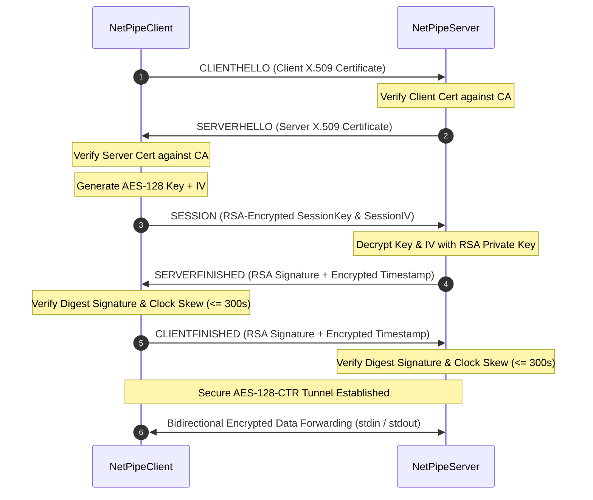

# Secure NetPipe

A Java implementation of an encrypted, mutually authenticated client/server protocol over TCP. Secure NetPipe acts as an encrypted transport proxy: it authenticates both endpoints using X.509 certificates, exchanges an AES session key via RSA, and forwards stdin/stdout traffic over an AES-128-CTR encrypted TCP tunnel.

---

## Overview & Architecture

NetPipe uses a multi-stage handshake before transitioning a socket connection to encrypted stream forwarding.




---

## Technical Highlights

- **Framing & TCP Boundary Safety**: Handshake messages are serialized using a 4-byte big-endian length prefix. Payload size is capped at 64 KB (`MAX_MESSAGE_SIZE = 65536`) to protect against buffer overflow and DoS attacks. Partial reads are handled explicitly via `DataInputStream.readFully()`.
- **Protocol State Machine**: Both client and server maintain a thread-safe `ProtocolStateMachine`. Invalid state transitions (e.g., receiving a `SESSION` message prior to `SERVERHELLO`) trigger `ProtocolStateException` and terminate the socket connection.
- **Cryptographic Operations**:
  - **Mutual Authentication**: X.509 certificates (DER/PEM) validated against a trusted Certificate Authority (CA) including validity period verification (`checkValidity()`).
  - **Key Exchange**: RSA-2048 encryption of a randomly generated 128-bit AES session key and 16-byte Initialization Vector (IV).
  - **Handshake Verification**: SHA-256 message digests signed with RSA private keys.
  - **Replay Protection**: Encrypted ISO timestamps (`yyyy-MM-dd HH:mm:ss`) checked against a 300-second maximum clock skew window.
  - **Data Encryption**: AES-128 in Counter Mode (`AES/CTR/NoPadding`), transforming the block cipher into a stream cipher for real-time bidirectional stream forwarding.
- **Concurrency**: `NetPipeServer` utilizes a thread pool to handle multiple simultaneous client handshakes independently.

---

## Repository Structure

```text
se.ermia.netpipe
├── client          # NetPipeClient entry point & client-side orchestrator
├── server          # NetPipeServer multithreaded server & connection handler
├── protocol        # HandshakeMessage, MessageType, ProtocolState, ProtocolStateMachine
├── crypto          # HandshakeCertificate, HandshakeCrypto, HandshakeDigest, SessionKey, SessionCipher
├── transport       # Forwarder (bidirectional stream piping)
├── config          # Arguments parser and NetPipeConfig (CLI > Env > Default precedence)
├── util            # CryptoUtils helper methods
└── exception       # Typed exception hierarchy (NetPipeException base)
```

---

## Building and Running

### Prerequisites

- Java 17+
- Maven 3.8+ (or included `./mvnw`)
- Docker & Docker Compose (optional)

### Build & Verify

```bash
# Compile and run unit + integration tests
./mvnw clean verify

# Run static analysis (Checkstyle, SpotBugs, PMD)
./mvnw checkstyle:check spotbugs:check pmd:check
```

### Command Line Execution

Generate or locate test certificates (found in `src/test/resources/certs/` for testing):

**Start Server**:
```bash
./mvnw exec:java -Dexec.mainClass="se.ermia.netpipe.server.NetPipeServer" \
  -Dexec.args="--port=2206 --usercert=src/test/resources/certs/server.pem --cacert=src/test/resources/certs/ca.pem --key=src/test/resources/certs/server-private.der"
```

**Connect Client**:
```bash
./mvnw exec:java -Dexec.mainClass="se.ermia.netpipe.client.NetPipeClient" \
  -Dexec.args="--host=localhost --port=2206 --usercert=src/test/resources/certs/client.pem --cacert=src/test/resources/certs/ca.pem --key=src/test/resources/certs/client-private.der"
```

### Docker Execution

```bash
# Spin up server and client containers over bridge network
docker compose up --build

# Run automated end-to-end container test
./docker/demo.sh
```

---

## Test Suite & Quality Assurance

The repository includes 60+ automated test cases:

- **Unit Tests (`src/test/java/.../*Test.java`)**: Isolated validation of RSA/AES wrappers, certificate parsing, message framing, digest computation, and state machine transitions using **JUnit 5** and **AssertJ**.
- **Property-Based Tests (`*PropertyTest.java`)**: Invariant testing via **jqwik** verifying that `decrypt(encrypt(data)) == data` and `decode(encode(msg)) == msg` across thousands of generated inputs.
- **Integration & Concurrency Tests (`src/test/java/.../*IT.java`)**: Real local socket handshakes using random port allocation, concurrent multi-client connections, and resilience tests for truncated frames, oversized payloads, and invalid certificate chains.
- **Static Analysis & Coverage**: Enforced in Maven build via JaCoCo (coverage tracking), Checkstyle (formatting), SpotBugs (bytecode analysis), and PMD (source rules).

---

## Attribution & Credits

- **Original Project Concept & Skeleton**: KTH Royal Institute of Technology / Prof. Peter Sjödin (IK2206 Internet Security and Privacy). Skeleton code provided starting points for `NetPipeClient`, `NetPipeServer`, `HandshakeMessage`, `Forwarder`, and `Arguments`.
- **Implementation, Refactoring & Systems Infrastructure**: Completed by **Ermia Ghaffari**. Developed the cryptographic handshake, X.509 validation, AES-CTR stream piping, protocol state machine, custom exception hierarchy, unit/integration/property test suite, Docker/Compose setup, Maven build configuration, and CI/CD pipelines.

---

## License

Educational use.
