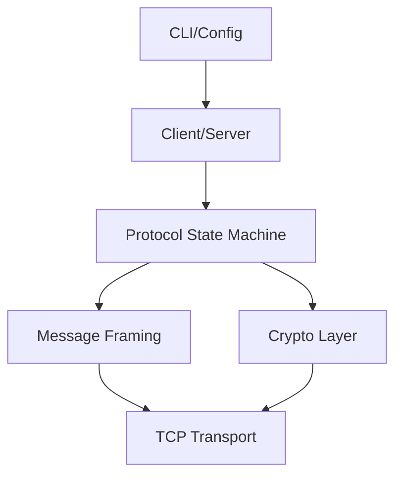

# Secure NetPipe Architecture

## Architecture Overview

## Package Structure

- `se.ermia.netpipe.client`: Client-side connection and initialization logic.
- `se.ermia.netpipe.server`: Server-side connection acceptance and worker thread pooling.
- `se.ermia.netpipe.protocol`: Core handshake messages, serialization, framing, and state machine enforcement.
- `se.ermia.netpipe.crypto`: Cryptographic operations including RSA key exchange, AES-CTR stream cipher, X.509 certificate handling, and secure random generation.
- `se.ermia.netpipe.config`: Configuration models, CLI argument parsing, and environment variables.
- `se.ermia.netpipe.exception`: Custom exception hierarchy for categorized error handling.

## Class Responsibilities

- **NetPipeServer / NetPipeClient**: Entry points managing TCP sockets and initiating the handshake phase.
- **ProtocolStateMachine**: Enforces valid transitions between handshake protocol states. Ensures messages arrive in the correct sequence.
- **HandshakeMessage**: Responsible for serializing `Properties` into a 4-byte length-prefixed payload and parsing incoming data securely (enforcing `MAX_MESSAGE_SIZE`).
- **SessionCipher**: Wraps standard `InputStream`/`OutputStream` in `CipherInputStream`/`CipherOutputStream` utilizing AES-128-CTR for transparent stream encryption/decryption.
- **HandshakeCertificate**: Manages X.509 certificates and extracts public keys.

## Design Decisions and Tradeoffs

- **Properties-based Message Format:** Inherited from the educational protocol skeleton (KTH IK2206). It provides a simple key-value structure but incurs overhead compared to a pure binary protocol.
- **AES-CTR Mode:** Selected because Counter (CTR) mode turns a block cipher into a stream cipher. This allows bidirectional data forwarding without requiring padding (`NoPadding`) or block alignment, crucial for arbitrary TCP stream forwarding.
- **Thread-per-Connection:** Simplifies the mental model and implementation for an educational server. Each client connection gets a dedicated thread for the handshake and two forwarder threads (one for each direction). In high-scale production systems, non-blocking I/O (NIO) or virtual threads would be preferred.
- **Custom Exceptions:** Using domain-specific exceptions (`CryptoException`, `InvalidMessageException`, `ProtocolStateException`) allows clear categorization of errors, separating protocol violations from IO errors or cryptographic failures.
- **State Machine:** Explicitly models the handshake flow. It prevents state bypass attacks (e.g., sending a `SESSION` message before `SERVERHELLO`) by verifying allowed transitions.

## Concurrency Model

- **Server Thread Pool:** The server listens on the main thread and dispatches accepted sockets to a pre-configured thread pool.
- **Forwarder Threads:** Once the secure channel is established, two threads are spawned per connection: one for `Client -> Server` forwarding and one for `Server -> Client` forwarding.
- **State Machine Safety:** `ProtocolStateMachine` state transitions are synchronized, making the state machine thread-safe, even if read/write operations happen concurrently in different phases.

## Error Handling Strategy

Errors during the handshake immediately tear down the TCP connection to prevent leakage of information or partial state exploitation. Exceptions are caught at the top level of the client or server worker thread, logged appropriately, and the socket is closed.

## Testing Strategy

The project employs a layered testing approach:
1. **Unit Tests:** Verify individual components like cipher initialization, state machine transitions, and message serialization.
2. **Property Tests (`jqwik`):** Ensure serialization and parsing work correctly across a wide range of random payloads and edge cases.
3. **Integration Tests:** Verify components working together, such as the full cryptographic handshake loop in-memory.
4. **End-to-End (E2E) Tests:** Utilize Testcontainers to spin up the actual Client and Server applications over real TCP sockets.
5. **Concurrency Tests:** Ensure thread safety of the server under multiple simultaneous connections.
