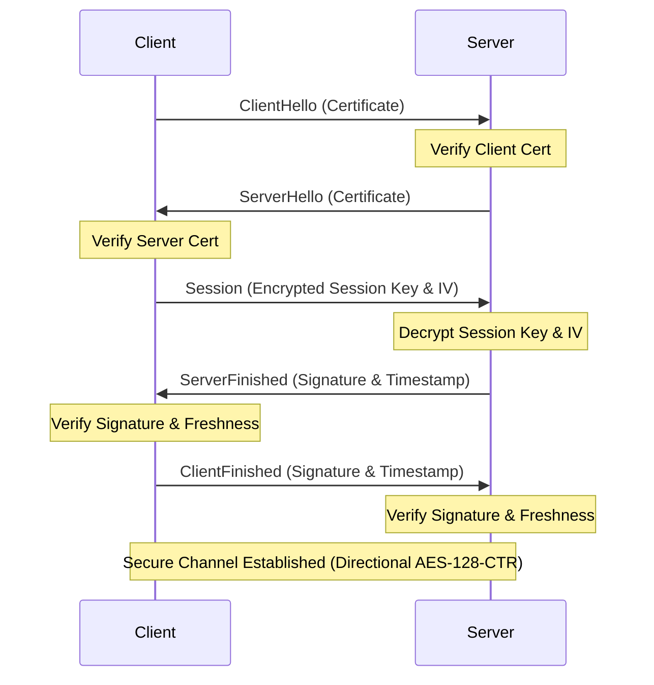
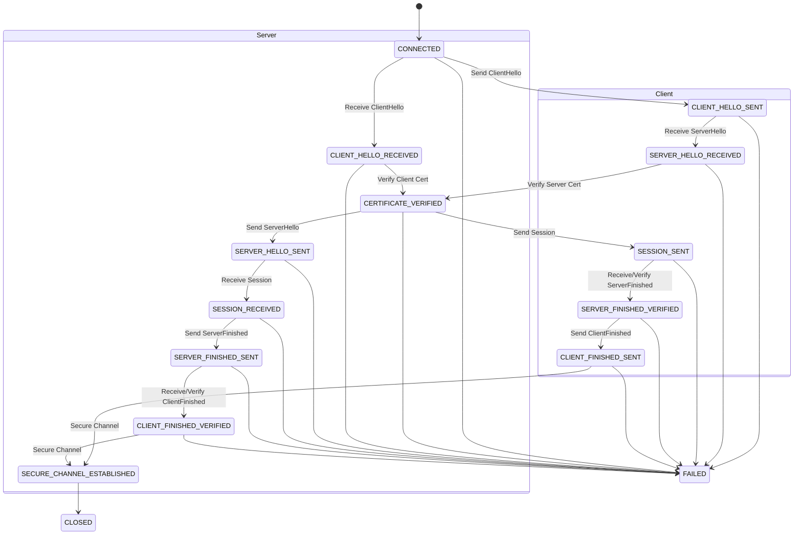

# Secure NetPipe Protocol Documentation

## Protocol Overview

Secure NetPipe implements a custom secure transport protocol designed for educational purposes, providing authentication, key exchange, and confidentiality over TCP. It ensures mutual authentication using X.509 certificates and establishes a secure channel encrypted with AES-128-CTR.

## Handshake Sequence

## Protocol State Machine

## Message Framing

All handshake messages are serialized via Java Object Serialization and framed with a length prefix.
- **Length Prefix:** 4-byte big-endian integer.
- **Maximum Message Size:** `MAX_MESSAGE_SIZE = 65536` bytes. Messages exceeding this limit are rejected to prevent memory exhaustion attacks.

## Message Details

### ClientHello / ServerHello
- **Type:** `CLIENTHELLO` / `SERVERHELLO`
- **Parameters:**
  - `Certificate`: Base64 encoded X.509 DER certificate.

### Session
- **Type:** `SESSION`
- **Parameters:**
  - `SessionKey`: AES-128 key encrypted with the recipient's RSA public key (Base64).
  - `SessionIV`: Base Initialization Vector (IV) encrypted with the recipient's RSA public key (Base64).

### ServerFinished / ClientFinished
- **Type:** `SERVERFINISHED` / `CLIENTFINISHED`
- **Parameters:**
  - `Signature`: SHA-256 digest of all previous handshake messages, encrypted with the sender's RSA private key (Base64).
  - `Timestamp`: Current timestamp in `yyyy-MM-dd HH:mm:ss` format, encrypted with the sender's RSA private key (Base64).

## Validation Mechanisms

- **Timestamp Freshness Check:** Validates request freshness. Maximum allowed clock skew is 300 seconds.
- **Directional CTR Keystream Safety:** Derives distinct directional IVs ($IV_{c2s} = IV$, $IV_{s2c} = IV \oplus 0x80$) to guarantee that client-to-server and server-to-client streams never reuse the same CTR keystream (eliminating two-time pad vulnerability).
- **Certificate Verification:** Certificates are parsed in DER/PEM format and verified against the trusted CA (`certificate.verify(caPublicKey)`) alongside validity window verification (`certificate.checkValidity()`).
- **Session Key Exchange:** The client generates a random AES-128 key and IV, encrypting them with the server's RSA public key.

## Error Handling

Protocol violations are detected by the `ProtocolStateMachine`. If an unexpected message type is received for the current state, a `ProtocolStateException` is thrown, transitioning the state machine to `FAILED` and closing the connection. Invalid message lengths or formats result in `InvalidMessageException`.

## Security Considerations

> **Note:** This protocol is designed for educational purposes. Real production systems should use TLS.
- **RSA Padding:** Uses RSA PKCS1v1.5 padding rather than OAEP padding.
- **Custom Signatures:** Implements custom signing using encryption with private keys rather than utilizing standard `java.security.Signature` APIs.
- **Java Serialization:** Uses `ObjectInputStream`/`ObjectOutputStream` which carries inherent security risks if untrusted data is deserialized.
